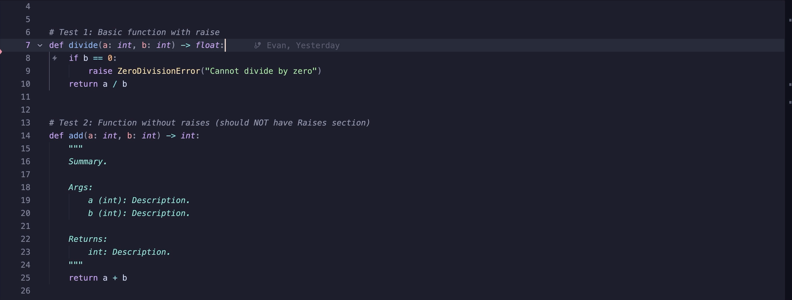

# Python Autodoc for Zed

---

Generates PEP 257 docstrings for Python functions and classes. Type `"""` on the line after a definition to trigger completion.

Handles typed parameters, return types, exceptions, dataclasses, async functions, `*args`/`**kwargs`, and nested functions.

## Examples

1. **Function with typed parameters**

   

2. **Function with exceptions**

   

3. **Dataclasses**

4. **Complex signatures**

   

More examples can be found in [examples/](examples/).

**PEP 257 notes**:
- Class docstrings get a summary only; `__init__` parameters are documented in `__init__`
- `None` return types are omitted
- `Raises:` is only generated when the function body contains `raise` statements

## License

MIT — see [LICENSE](LICENSE).
